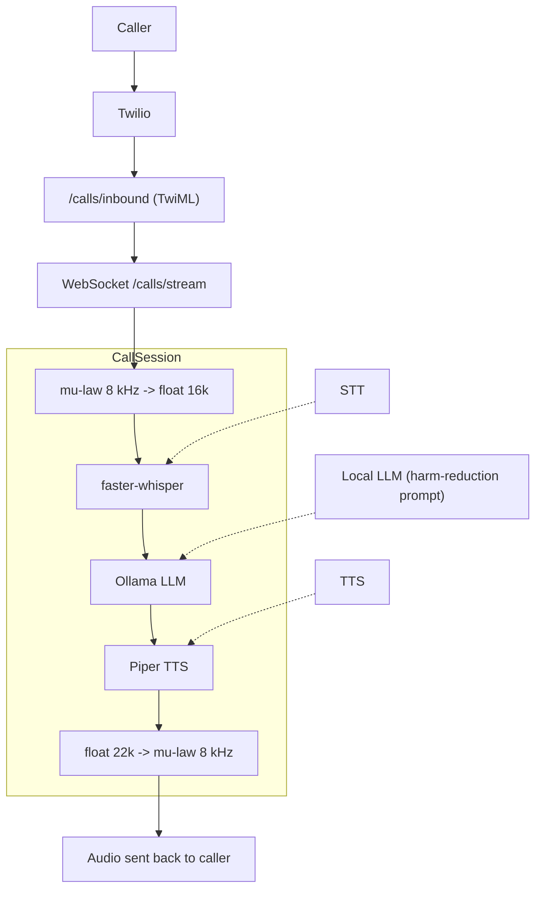

# Therfour

**Multilingual Voice Agent for Harm Reduction**

Therfour is a modular, open-source backend for telephone-based [harm-reduction
and harm-prevention](https://doi.org/10.1080/13811118.2020.1823916) helplines. It connects to a phone call via
[Twilio Media Streams](https://www.twilio.com/docs/voice/media-streams), runs
all AI inference locally, and returns synthesised speech – no data ever leaves
your infrastructure.

Telephony support status:

- Twilio Media Streams: production path
- Asterisk/FreePBX (ARI ExternalMedia): compatibility work is pending (stubs only)



## Tech stack

| Layer       | Library / Tool                                                                                                   |
| ----------- | ---------------------------------------------------------------------------------------------------------------- |
| Web server  | [FastAPI](https://fastapi.tiangolo.com) + Uvicorn                                                                |
| Telephony   | [Twilio Media Streams](https://www.twilio.com/docs/voice/media-streams) (Asterisk/FreePBX compatibility pending) |
| STT         | [faster-whisper](https://github.com/SYSTRAN/faster-whisper)                                                      |
| VAD         | [silero-vad](https://github.com/snakers4/silero-vad)                                                             |
| TTS         | [Piper](https://github.com/rhasspy/piper)                                                                        |
| LLM         | [Ollama](https://ollama.com) (local, any model)                                                                  |
| Audio codec | Python `audioop` / `audioop-lts` + SciPy                                                                         |

## Quick start

### Prerequisites

- Python 3.11+
- [Piper binary](https://github.com/rhasspy/piper/releases) on your `$PATH`
- [Ollama](https://ollama.com) running locally with your chosen model pulled
- A Twilio account with a voice-capable phone number

### 1 – Install Python dependencies

```bash
pip install -r requirements.txt
```

### 2 – Download a Piper voice model

```bash
mkdir -p models/piper

# Option A: hydrate from a tracked Google Drive stub manifest
python scripts/fetch_gdrive_stub.py models/stubs/piper/en_US-lessac-medium.onnx.stub.json
python scripts/fetch_gdrive_stub.py models/stubs/piper/en_US-lessac-medium.onnx.json.stub.json

# Option B: download manually if you are not using the stub flow
wget -q https://huggingface.co/rhasspy/piper-voices/resolve/v1.0.0/en/en_US/lessac/medium/en_US-lessac-medium.onnx \
     -O models/piper/en_US-lessac-medium.onnx
wget -q https://huggingface.co/rhasspy/piper-voices/resolve/v1.0.0/en/en_US/lessac/medium/en_US-lessac-medium.onnx.json \
     -O models/piper/en_US-lessac-medium.onnx.json
```

### 3 – Pull an Ollama model

```bash
ollama pull llama3.2:3b   # ~2 GB; swap for any model you prefer
```

If you keep local `.gguf`, `.safetensors`, or other LLM packs inside `models/llm/`,
the repo now routes those files through Git LFS instead of plain git blobs.

### 4 – Configure environment

```bash
cp .env.example .env
# Edit .env – at minimum set TWILIO_ACCOUNT_SID, TWILIO_AUTH_TOKEN, PUBLIC_HOST
```

### 5 – Start the server

```bash
uvicorn app.main:app --reload
```

Expose the server to the internet (e.g. via [ngrok](https://ngrok.com)) and
configure your Twilio phone number to send voice webhooks to
`https://<your-host>/calls/inbound`.

### Docker Compose

```bash
cp .env.example .env   # edit as above
docker compose up --build
```

Ollama and the application container are started together. Pull your model
inside the ollama container after first boot:

```bash
docker compose exec ollama ollama pull llama3.2:3b
```

## Project structure

```
app/
├── main.py                  # FastAPI application
├── core/
│   └── config.py            # Pydantic-settings configuration
├── models/
│   └── schemas.py           # Shared Pydantic schemas
├── api/routes/
│   ├── health.py            # GET /health
│   └── calls.py             # POST /calls/inbound  WS /calls/stream
└── services/
    ├── stt.py               # Speech-to-text  (faster-whisper)
    ├── tts.py               # Text-to-speech  (Piper)
    ├── llm.py               # LLM generation  (Ollama)
    └── telephony.py         # Audio pipeline + CallSession orchestrator
tests/
├── test_api.py
├── test_stt.py
├── test_tts.py
├── test_llm.py
└── test_telephony.py
```

## Running tests

```bash
pytest
```

## STT Benchmark Harness

To compare `small` vs `distil-large-v3` on telephony-focused samples, use the benchmark harness in `benchmarks/`.

The harness uses:

- `https://github.com/voxserv/audio_quality_testing_samples`

and writes machine-readable outputs to `benchmarks/results/`.

Run from repo root:

```bash
/Users/argussun/Documents/Therfour/.venv/bin/python benchmarks/compare_whisper_models.py \
     --models small distil-large-v3 \
     --subdir testaudio \
     --device auto \
     --repeats 3
```

For more options and reproducibility guidance, see `benchmarks/README.md`.

## Swift migration (in progress)

To start moving server-side logic from Python to Swift, this repository now
includes a small Swift package at `swift-backend/` that mirrors shared response
models and the `/health` payload contract.

Run Swift tests:

```bash
cd swift-backend
swift test
```

## Configuration reference

All settings can be overridden via environment variables or a `.env` file.
See `.env.example` for the full list with descriptions.

<<<<<<< HEAD
### Transfer routing (number + SIP)

The call transfer flow supports emergency handoff (`911`, `988`) plus optional
custom transfer targets.

- Number transfers: dial PSTN/E.164 targets.
- SIP transfers: dial SIP endpoints and attach metadata as SIP headers.
- Compatibility mode: for PSTN targets, keep metadata in app logs but do not
  send SIP headers.

Suggested `.env` settings:

```env
TRANSFER_HARNESS_ENABLED=true
SIMULATION_HARNESS_ENABLED=true
TRANSFER_ALLOW_CUSTOM_TARGETS=true
TRANSFER_ALLOWED_NUMBERS=+14155550100,+14155550101
TRANSFER_ALLOWED_SIP_DOMAINS=example.com,care.example.org
TRANSFER_METADATA_MODE=compat
RAG_WAITING_AUDIO_ENABLED=true
RAG_WAITING_AUDIO_DELAY_S=0.35
RAG_WAITING_AUDIO_ASSETS_DIR=app/assets/waiting_audio
TRANSFER_CONFIRMATION_REQUIRED=true
TRANSFER_POST_CALL_REOPEN_MODE=off
TRANSFER_SERVICES_ENABLED=true
TRANSFER_SERVICES_CONFIG_PATH=app/core/transfer_services.json
TRANSFER_CUSTOM_POST_CALL_REOPEN_MODE=prompt
CALL_FLOW_PHRASES_ENABLED=true
CALL_FLOW_PHRASES_CONFIG_PATH=app/core/call_flow_phrases.json
CALL_END_PRESENCE_DELAY_S=12
CALL_END_PRESENCE_ROUNDS=2
```

Recommended emergency post-call reopen presets:

```env
# 1) Strict safety baseline: never reopen after 911/988 operator disconnect
TRANSFER_POST_CALL_REOPEN_MODE=off

# 2) Continuity focused: always reopen after operator disconnect
TRANSFER_POST_CALL_REOPEN_MODE=auto

# 3) Caller-choice flow: ask caller before transfer whether Terris should reopen
TRANSFER_POST_CALL_REOPEN_MODE=prompt
```

Transfer config behavior:

- `TRANSFER_HARNESS_ENABLED`: enables `POST /calls/transfer/harness`.
- `SIMULATION_HARNESS_ENABLED`: enables `POST /calls/simulation/report`.
- `TRANSFER_ALLOW_CUSTOM_TARGETS`: allows non-`911`/`988` targets.
- `TRANSFER_ALLOWED_NUMBERS`: allowlist for custom PSTN numbers.
- `TRANSFER_ALLOWED_SIP_DOMAINS`: allowlist for SIP destination domains.
- `TRANSFER_METADATA_MODE`:
  - `compat`: metadata on PSTN transfers is accepted and logged.
  - `strict`: metadata on PSTN transfers is rejected.
- `RAG_WAITING_AUDIO_ENABLED`: plays short filler audio while RAG-backed response generation is pending.
- `RAG_WAITING_AUDIO_DELAY_S`: grace delay before filler playback starts.
- `RAG_WAITING_AUDIO_ASSETS_DIR`: directory for phrase/ambient `.wav` assets copied from HealthCoacher.
  Current phrase selection supports `en`, `zh`, `yue`, and `ja`, with fallback to English.
- `TURN_INTERRUPT_ENABLED`: cancels active assistant generation/playback and clears Twilio outbound audio when caller barges in.
- `TRANSFER_CONFIRMATION_REQUIRED`: asks caller for verbal confirmation before 911/988 transfer is executed.
- `TRANSFER_POST_CALL_REOPEN_MODE`:
  - `off`: never reopen after 911/988 operator disconnect.
  - `auto`: always reopen after 911/988 operator disconnect.
  - `prompt`: ask caller before transfer whether Terris should reopen.
- `TRANSFER_SERVICES_ENABLED`: enables catalog-driven custom transfer offerings.
- `TRANSFER_SERVICES_CONFIG_PATH`: JSON file defining custom transfer services
  (name/description/target) Terris is allowed to offer.
- `TRANSFER_CUSTOM_POST_CALL_REOPEN_MODE`:
  - `off`: never reopen after custom transfer destination disconnect.
  - `auto`: always reopen after custom transfer destination disconnect.
  - `prompt`: ask caller before custom transfer whether Terris should reopen.
- `CALL_FLOW_PHRASES_ENABLED`: enables randomized openers/terminators from phrase catalog.
- `CALL_FLOW_PHRASES_CONFIG_PATH`: JSON file containing five openers and five terminators.
- `CALL_END_PRESENCE_DELAY_S`: delay between terminator and each `Are you still there?` round.
- `CALL_END_PRESENCE_ROUNDS`: number of `Are you still there?` rounds before Terris ends call.

Harness examples:

```bash
# PSTN transfer (dry run)
curl -X POST http://localhost:8000/calls/transfer/harness \
  -H 'Content-Type: application/json' \
  -d '{
    "target_kind": "number",
    "target": "+14155550100",
    "forwarded_by": "Terris",
    "topic": "overdose-risk",
    "priority": "high",
    "execute_live_update": false
  }'

# SIP transfer with custom headers (dry run)
curl -X POST http://localhost:8000/calls/transfer/harness \
  -H 'Content-Type: application/json' \
  -d '{
    "target_kind": "sip",
    "target": "sip:agent@example.com",
    "forwarded_by": "Terris",
    "topic": "withdrawal-support",
    "priority": "normal",
    "execute_live_update": false
  }'

# Simulation report writer (Tier A headless)
curl -X POST http://localhost:8000/calls/simulation/report \
  -H 'Content-Type: application/json' \
  -d '{
    "tier": "tier_a",
    "max_turns": 8,
    "frustration_hangup_threshold": 6,
    "force_low_confidence_every_n_turns": 3,
    "use_live_therfour_llm": false,
    "output_filename": "sim_report.json"
  }'

# Fetch recent simulation reports (metadata only)
curl "http://localhost:8000/calls/simulation/reports/recent?limit=5"

# Fetch recent simulation reports with embedded report body
curl "http://localhost:8000/calls/simulation/reports/recent?limit=5&include_report=true"

# Fetch a single simulation report by filename
curl "http://localhost:8000/calls/simulation/reports/sim_report.json"
```

LLM transfer directives:

- Legacy: `TRANSFER:911` or `TRANSFER:988`
- Extended: `TRANSFER:number:+14155550100` or `TRANSFER:sip:sip:agent@example.com`
- Optional metadata line:
  `TRANSFER-META:forwarded-by=Terris;topic=overdose-risk;priority=high`

## Model artifact storage

Therfour now follows the same broad pattern used in HealthCoacher for large local
artifacts:

- lightweight stub manifests live in `models/stubs/`
- downloaded or checked-in model binaries live under `models/`
- large binary artifacts under `models/` are tracked with Git LFS

Use the stub flow when you want the repo to carry only metadata for a model stored
in Google Drive or Hugging Face. A stub manifest records the target path, provider,
source metadata, and optional checksum without committing the actual artifact.

Hydrate a stub into a local file:

```bash
python scripts/fetch_stub.py models/stubs/piper/en_US-lessac-medium.onnx.stub.json
python scripts/fetch_stub.py models/stubs/llm/Kunoichi-DPO-v2-7B-Q4_K_S-imatrix.gguf.stub.json
```

To update a stub for your own asset, copy one of the example manifests in
`models/stubs/`, update the provider source fields, and optionally add a `sha256`.

If you intentionally commit a large model artifact into `models/`, install Git LFS
first:

```bash
git lfs install
git add .gitattributes models/llm/<your-model>.gguf
```

| Variable                        | Default                                 | Description                                           |
| ------------------------------- | --------------------------------------- | ----------------------------------------------------- |
| `WHISPER_MODEL`                 | `small`                                 | faster-whisper model size                             |
| `WHISPER_LANGUAGE`              | _(auto-detect)_                         | Pin transcription language                            |
| `WHISPER_FALLBACK_ENABLED`      | `true`                                  | Enables secondary Whisper decode attempt              |
| `WHISPER_PRIMARY_BEAM_SIZE`     | `5`                                     | Beam size for primary decode attempt                  |
| `WHISPER_FALLBACK_BEAM_SIZE`    | `1`                                     | Beam size for fallback decode attempt                 |
| `STT_MIN_TEXT_CHARACTERS`       | `2`                                     | Minimum transcript length before accept               |
| `STT_MIN_QUALITY_SCORE`         | `0.25`                                  | Minimum heuristic quality score                       |
| `VAD_ENABLED`                   | `true`                                  | Enables Silero streaming VAD segmentation             |
| `VAD_THRESHOLD`                 | `0.5`                                   | Speech probability threshold                          |
| `VAD_MIN_SILENCE_MS`            | `300`                                   | Silence duration required to close turn               |
| `VAD_SPEECH_PAD_MS`             | `96`                                    | Speech padding around detected boundaries             |
| `VAD_PREROLL_MS`                | `96`                                    | Audio preroll retained before speech start            |
| `PIPER_BINARY`                  | `piper`                                 | Path to the Piper executable                          |
| `PIPER_MODEL_PATH`              | `models/piper/en_US-lessac-medium.onnx` | Piper voice model                                     |
| `OLLAMA_MODEL`                  | `llama3.2:3b`                           | Ollama model tag                                      |
| `OLLAMA_BASE_URL`               | `http://localhost:11434`                | Ollama API base URL                                   |
| `SILENCE_TIMEOUT_S`             | `1.5`                                   | Seconds of silence before turn processing             |
| `PUBLIC_HOST`                   | `localhost`                             | Hostname used in the TwiML `<Stream>` URL             |
| `TRANSFER_HARNESS_ENABLED`      | `false`                                 | Enables transfer harness endpoint                     |
| `SIMULATION_HARNESS_ENABLED`    | `false`                                 | Enables simulation report endpoint                    |
| `TRANSFER_ALLOW_CUSTOM_TARGETS` | `false`                                 | Allows custom transfer targets beyond 911/988         |
| `TRANSFER_ALLOWED_NUMBERS`      | _(empty)_                               | Comma-separated PSTN/E.164 transfer allowlist         |
| `TRANSFER_ALLOWED_SIP_DOMAINS`  | _(empty)_                               | Comma-separated SIP domain allowlist                  |
| `TRANSFER_METADATA_MODE`        | `compat`                                | PSTN metadata handling mode (`compat`/`strict`)       |
| `RAG_WAITING_AUDIO_ENABLED`     | `false`                                 | Plays filler phrase and ambient audio during RAG wait |
| `RAG_WAITING_AUDIO_DELAY_S`     | `0.35`                                  | Delay before waiting audio starts                     |
| `RAG_WAITING_AUDIO_ASSETS_DIR`  | `app/assets/waiting_audio`              | Waiting-audio asset directory                         |
| `TURN_INTERRUPT_ENABLED`        | `true`                                  | Interrupt active assistant turn on caller speech      |
=======
| Variable            | Default                           | Description                               |
| ------------------- | --------------------------------- | ----------------------------------------- |
| `WHISPER_MODEL`     | `small`                           | faster-whisper model size                 |
| `WHISPER_LANGUAGE`  | _(auto-detect)_                   | Pin transcription language                |
| `PIPER_BINARY`      | `piper`                           | Path to the Piper executable              |
| `PIPER_MODEL_PATH`  | `models/en_US-lessac-medium.onnx` | Piper voice model                         |
| `OLLAMA_MODEL`      | `llama3.2:3b`                     | Ollama model tag                          |
| `OLLAMA_BASE_URL`   | `http://localhost:11434`          | Ollama API base URL                       |
| `SILENCE_TIMEOUT_S` | `1.5`                             | Seconds of silence before turn processing |
| `PUBLIC_HOST`       | `localhost`                       | Hostname used in the TwiML `<Stream>` URL |
>>>>>>> bc65abb (changed figure in readme)
