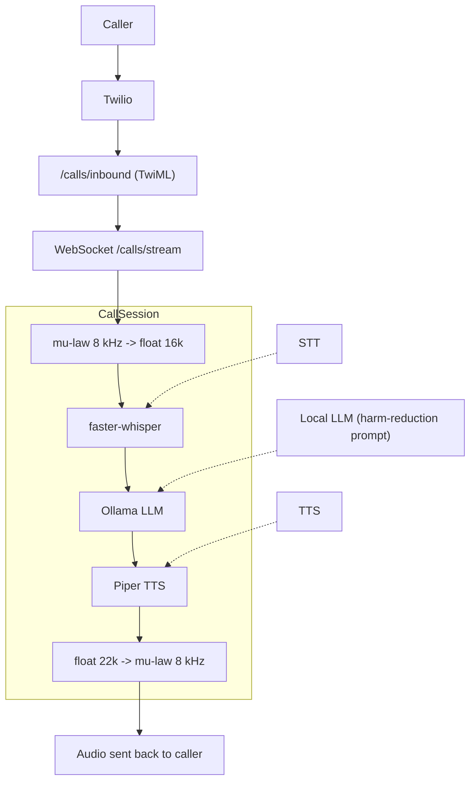

# Therfour

**Multilingual Voice Agent for Harm Reduction**

Therfour is a modular, open-source backend for telephone-based [harm-reduction
and harm-prevention](https://doi.org/10.1080/13811118.2020.1823916) helplines. It connects to a phone call via
[Twilio Media Streams](https://www.twilio.com/docs/voice/media-streams), runs
all AI inference locally, and returns synthesised speech – no data ever leaves
your infrastructure.



## Tech stack

| Layer       | Library / Tool                                                          |
| ----------- | ----------------------------------------------------------------------- |
| Web server  | [FastAPI](https://fastapi.tiangolo.com) + Uvicorn                       |
| Telephony   | [Twilio Media Streams](https://www.twilio.com/docs/voice/media-streams) |
| STT         | [faster-whisper](https://github.com/SYSTRAN/faster-whisper)             |
| TTS         | [Piper](https://github.com/rhasspy/piper)                               |
| LLM         | [Ollama](https://ollama.com), LM Studio, or OpenAI-compatible providers |
| Audio codec | Python `audioop` / `audioop-lts` + SciPy                                |

## Quick start

### Prerequisites

- Python 3.11+
- [Piper binary](https://github.com/rhasspy/piper/releases) on your `$PATH`
- One LLM backend configured: [Ollama](https://ollama.com), LM Studio, or OpenAI
- A Twilio account with a voice-capable phone number

### 1 – Install Python dependencies

```bash
pip install -r requirements.txt
```

### 2 – Download Piper voice models

```bash
mkdir -p models
# English (US) – libritts_r medium voice (default)
wget -q https://huggingface.co/rhasspy/piper-voices/resolve/v1.0.0/en/en_US/libritts_r/medium/en_US-libritts_r-medium.onnx \
     -O models/en_US-libritts_r-medium.onnx
wget -q https://huggingface.co/rhasspy/piper-voices/resolve/v1.0.0/en/en_US/libritts_r/medium/en_US-libritts_r-medium.onnx.json \
     -O models/en_US-libritts_r-medium.onnx.json

# English (US) – amy medium voice
wget -q https://huggingface.co/rhasspy/piper-voices/resolve/v1.0.0/en/en_US/amy/medium/en_US-amy-medium.onnx \
     -O models/en_US-amy-medium.onnx
wget -q https://huggingface.co/rhasspy/piper-voices/resolve/v1.0.0/en/en_US/amy/medium/en_US-amy-medium.onnx.json \
     -O models/en_US-amy-medium.onnx.json
```

### 3 – Pull an Ollama model

```bash
ollama pull llama3.2:3b   # ~2 GB; swap for any model you prefer
```

### 4 – Configure environment

```bash
cp .env.example .env
# Edit .env – at minimum set TWILIO_ACCOUNT_SID, TWILIO_AUTH_TOKEN, PUBLIC_HOST
```

### 5 – Start the server

```bash
uvicorn app.main:app --reload
```

Expose the server to the internet (e.g. via [ngrok](https://ngrok.com)) and
configure your Twilio phone number to send voice webhooks to
`https://<your-host>/calls/inbound`.

### Docker Compose

```bash
cp .env.example .env   # edit as above
docker compose up --build
```

Ollama and the application container are started together. Pull your model
inside the ollama container after first boot:

```bash
docker compose exec ollama ollama pull llama3.2:3b
```

## Project structure

```
app/
├── main.py                  # FastAPI application
├── core/
│   └── config.py            # Pydantic-settings configuration
├── models/
│   └── schemas.py           # Shared Pydantic schemas
├── api/routes/
│   ├── health.py            # GET /health
│   └── calls.py             # POST /calls/inbound  WS /calls/stream
└── services/
    ├── stt.py               # Speech-to-text  (faster-whisper)
    ├── tts.py               # Text-to-speech  (Piper)
    ├── llm.py               # LLM generation  (Ollama)
    └── telephony.py         # Audio pipeline + CallSession orchestrator
tests/
├── test_api.py
├── test_stt.py
├── test_tts.py
├── test_llm.py
└── test_telephony.py
```

## Running tests

```bash
pytest
```

## Swift migration (in progress)

To start moving server-side logic from Python to Swift, this repository now
includes a small Swift package at `swift-backend/` that mirrors shared response
models and the `/health` payload contract.

Run Swift tests:

```bash
cd swift-backend
swift test
```

## Configuration reference

All settings can be overridden via environment variables or a `.env` file.
See `.env.example` for the full list with descriptions.

| Variable                   | Default                               | Description                               |
| -------------------------- | ------------------------------------- | ----------------------------------------- |
| `WHISPER_MODEL`            | `small`                               | faster-whisper model size                 |
| `WHISPER_LANGUAGE`         | _(auto-detect)_                       | Pin transcription language                |
| `PIPER_BINARY`             | `piper`                               | Path to the Piper executable              |
| `PIPER_MODEL_PATH`         | `models/en_US-libritts_r-medium.onnx` | Piper fallback voice model path           |
| `PIPER_DEFAULT_VOICE_ID`   | `en-US-libritts-r-medium`             | Default Piper voice id                    |
| `PIPER_VOICES_CONFIG_PATH` | `app/core/piper_voices.json`          | Piper voice catalog config                |
| `LLM_PROVIDER`             | `ollama`                              | LLM backend: `ollama`, `lmstudio`, `openai` |
| `LLM_TIMEOUT`              | `60.0`                                | Shared LLM request timeout (seconds)      |
| `OLLAMA_MODEL`             | `llama3.2:3b`                         | Ollama model tag                          |
| `OLLAMA_BASE_URL`          | `http://localhost:11434`              | Ollama API base URL                       |
| `LMSTUDIO_MODEL`           | _(none)_                              | LM Studio model name                      |
| `LMSTUDIO_BASE_URL`        | `http://10.0.0.132:1234/v1`           | LM Studio OpenAI-compatible endpoint      |
| `OPENAI_MODEL`             | `gpt-4o-mini`                         | OpenAI chat model name                    |
| `OPENAI_BASE_URL`          | `https://api.openai.com/v1`           | OpenAI-compatible API base URL            |
| `OPENAI_API_KEY`           | _(empty)_                             | Required when `LLM_PROVIDER=openai`       |
| `SILENCE_TIMEOUT_S`        | `1.5`                                 | Seconds of silence before turn processing |
| `PUBLIC_HOST`              | `localhost`                           | Hostname used in the TwiML `<Stream>` URL |
